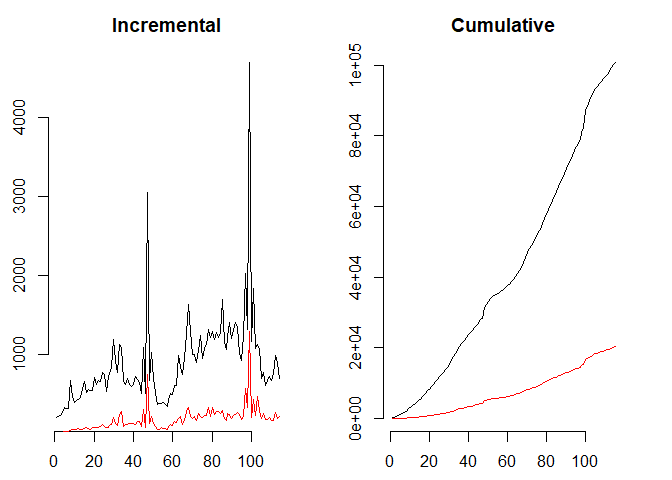
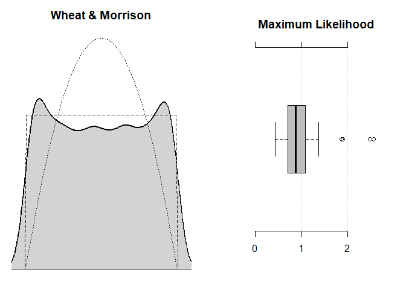
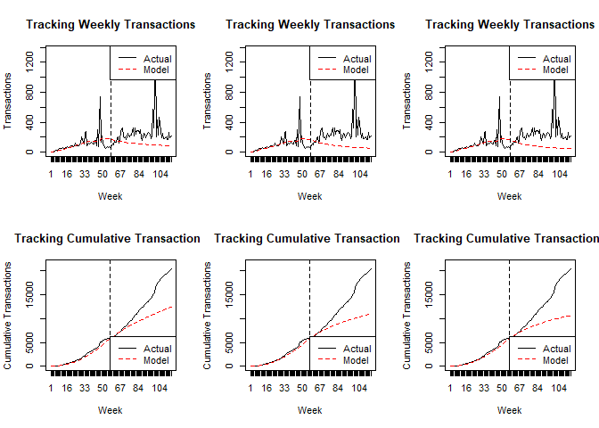
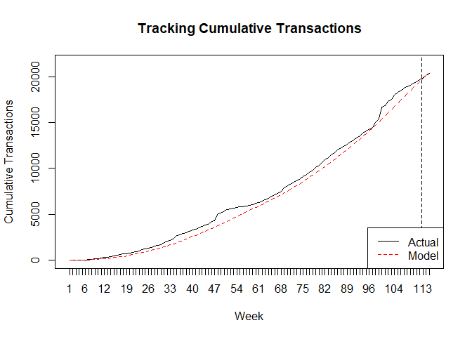
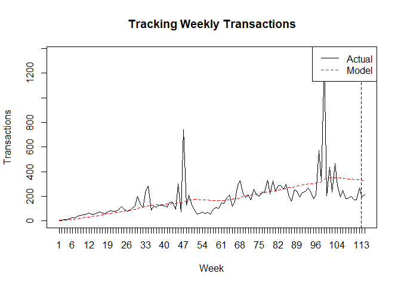
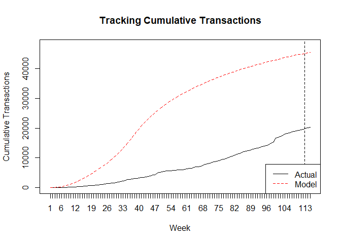
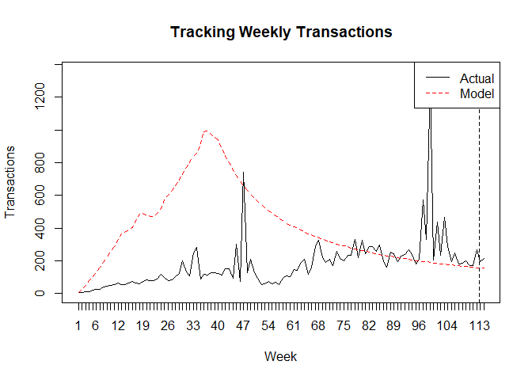

### Load data & preprocessing

```r
# load the data
rm(list=ls()); setwd("C:/Furong/3-Projects/CLV")
Log = read.csv("Orders Export v4.csv");colnames(Log)[1]= "Email"
# format date column
Log$Order.Date = as.POSIXct(as.POSIXlt(strptime(Log$Order.Date, format = "%m/%d/%y %H:%M")))
Log$Year.Month = substr(Log$Order.Date, 1,7);Log$date = as.Date(substr(Log$Order.Date, 1,10))
# get the columns for model
Log$cust = paste(Log$First.Name, Log$Last.Name, sep=" ")
Log[Log$cust==" ",]; Log[Log$cust==" ","cust"]= "jon@jonathanfriedman.com"
```

```
##                          Email First.Name Last.Name Order.Number
## 11849 jon@jonathanfriedman.com                             41615
##       Gross.Revenue   Tax Discounts Net.Revenue Shipping
## 11849           248 12.75      34.2       213.8        0
##                Order.Date Shipping.Address.1 Shipping.Address.2
## 11849 2016-06-01 03:39:00   10 GAY ST APT 1B                   
##       Shipping.City Shipping.State   Zip.Code Year.Month       date cust
## 11849      NEW YORK       New York 10014-3537    2016-06 2016-06-01
```

```r
Log2= Log[,c(8,17,18)];colnames(Log2)[1]="sales"
```


### EDA of cohort trend with BTYDplus

```r
library(BTYDplus);library(dplyr);library(BTYD)

# Check data trend
op = par(mfrow = c(1, 2), mar = c(2.5, 2.5, 2.5, 2.5))
# incremental
weekly_inc_total =elog2inc(Log2, by = 7, first = TRUE); weekly_inc_repeat=elog2inc(Log2, by=7, first = FALSE)
plot(weekly_inc_total, typ = "l", frame = FALSE, main = "Incremental");lines(weekly_inc_repeat, col = "red")
# cumulative
weekly_cum_total =elog2cum(Log2, by = 7, first = TRUE);weekly_cum_repeat=elog2cum(Log2, by=7, first = FALSE)
plot(weekly_cum_total, typ = "l", frame = FALSE, main = "Cumulative"); lines(weekly_cum_repeat, col = "red")
```

<!-- -->

```r
par(op)

# Check regularity
op = par(mfrow = c(1, 2))
(k.wheat =  estimateRegularity(Log2, method = "wheat",plot = TRUE, title = "Wheat & Morrison")); (k.mle = estimateRegularity(Log2, method = "mle",plot = TRUE, title = "Maximum Likelihood"))
```

```
## [1] 0.847896
```

<!-- -->

```
## [1] 0.874025
```

```r
par(op)

# two sharp spike can be observed near week 45 and week 100, which may due to shopping season or promotion event 
```
The x-axis represents time measured in weeks, thus we see that the customers were observed over a two year time period. The gap between the red line (=repeat transactions) and the black line (=total transactions) illustrates the customers' initial transactions.

Regularity check: A return value of close to 1 supports the assumption of exponentially distributed intertransaction times, whereas values significantly larger than 1 reveal the presence of regularity. Estimation is either done by 1) assuming a same degree of regularity across all customers (method = "wheat"), or 2) by estimating regularity for each customer separately, as the shape parameter of a fitted gamma distribution, and then return the median across estimates.


```r
# end of calibration date
endCal = min(Log2$date) + (max(Log2$date)-min(Log2$date))/2
# Create sales log to customer-by-sufficient-statistic
Log2CBS = elog2cbs(Log2, T.cal = endCal) 
```
x the number of repeat transactions (i.e., frequency)
t.x the time of the last recorded transaction (i.e., recency)
litt the sum over logarithmic intertransaction times (required for estimating regularity)
first the date of the first transaction
T.cal the duration between the first transaction and the end of the calibration period

### Model selection

```r
#####-------------------------------- Pareto/NBD----------------------------------
# Parameter estimation
params.pnbd= pnbd.EstimateParameters(Log2CBS)
pnbd.LL = pnbd.cbs.LL(params.pnbd, Log2CBS)
p.matrix = c(params.pnbd, pnbd.LL )# make a series of estimates, see if they converge
for (i in 1:10) {
  params.pnbd = pnbd.EstimateParameters(Log2CBS, params.pnbd)
	pnbd.LL = pnbd.cbs.LL(params.pnbd, Log2CBS)
	p.matrix.row = c(params.pnbd, pnbd.LL )
	p.matrix = rbind(p.matrix, p.matrix.row)
}
p.matrix
```

```
##                  [,1]     [,2]      [,3]     [,4]      [,5]
## p.matrix     1.002453 61.44813 0.5366132 3.229883 -33531.35
## p.matrix.row 1.002454 61.44806 0.5366129 3.229884 -33531.35
## p.matrix.row 1.002455 61.44802 0.5366131 3.229885 -33531.35
## p.matrix.row 1.002454 61.44802 0.5366134 3.229884 -33531.35
## p.matrix.row 1.002455 61.44800 0.5366135 3.229885 -33531.35
## p.matrix.row 1.002454 61.44800 0.5366137 3.229885 -33531.35
## p.matrix.row 1.002455 61.44799 0.5366137 3.229885 -33531.35
## p.matrix.row 1.002454 61.44799 0.5366139 3.229885 -33531.35
## p.matrix.row 1.002455 61.44798 0.5366139 3.229886 -33531.35
## p.matrix.row 1.002454 61.44798 0.5366140 3.229886 -33531.35
## p.matrix.row 1.002455 61.44798 0.5366140 3.229887 -33531.35
```

```r
params.pnbd = p.matrix[dim(p.matrix)[1],1:4]; names(params.pnbd) = c("r", "alpha", "s", "beta")# use final set of values

Log2CBS$xstar.pnbd = BTYD::pnbd.ConditionalExpectedTransactions(
params = params.pnbd, T.star = 57.42857,x = Log2CBS$x, t.x = Log2CBS$t.x, T.cal = Log2CBS$T.cal)

#####-----------------------------------BG/NBD------------------------------------
# Parameter estimation
params.bgnbd = BTYD::bgnbd.EstimateParameters(Log2CBS) 
bgnbd.LL = bgnbd.cbs.LL(params.bgnbd, Log2CBS)
p.matrix2 = c(params.bgnbd, bgnbd.LL )
for (i in 1:20) {
  params.bgnbd  = bgnbd.EstimateParameters(Log2CBS, params.bgnbd)
	bgnbd.LL = bgnbd.cbs.LL(params.bgnbd, Log2CBS)
	p.matrix2.row = c(params.bgnbd, bgnbd.LL)
	p.matrix2 = rbind(p.matrix2, p.matrix2.row)
}
p.matrix2
```

```
##                    [,1]     [,2]     [,3]     [,4]     [,5]
## p.matrix2     0.1032530 6.575249 3.457135 2.541250 -33500.8
## p.matrix2.row 0.1032547 6.575282 3.457192 2.541209 -33500.8
## p.matrix2.row 0.1032541 6.575331 3.457200 2.541203 -33500.8
## p.matrix2.row 0.1032549 6.575354 3.457208 2.541195 -33500.8
## p.matrix2.row 0.1032546 6.575386 3.457209 2.541192 -33500.8
## p.matrix2.row 0.1032552 6.575401 3.457207 2.541191 -33500.8
## p.matrix2.row 0.1032550 6.575429 3.457206 2.541190 -33500.8
## p.matrix2.row 0.1032554 6.575437 3.457204 2.541189 -33500.8
## p.matrix2.row 0.1032553 6.575463 3.457202 2.541189 -33500.8
## p.matrix2.row 0.1032556 6.575467 3.457199 2.541189 -33500.8
## p.matrix2.row 0.1032555 6.575493 3.457196 2.541188 -33500.8
## p.matrix2.row 0.1032558 6.575495 3.457194 2.541188 -33500.8
## p.matrix2.row 0.1032558 6.575522 3.457190 2.541187 -33500.8
## p.matrix2.row 0.1032560 6.575522 3.457189 2.541186 -33500.8
## p.matrix2.row 0.1032561 6.575554 3.457183 2.541185 -33500.8
## p.matrix2.row 0.1032562 6.575553 3.457182 2.541184 -33500.8
## p.matrix2.row 0.1032565 6.575599 3.457170 2.541180 -33500.8
## p.matrix2.row 0.1032566 6.575596 3.457169 2.541180 -33500.8
## p.matrix2.row 0.1032571 6.575641 3.457143 2.541165 -33500.8
## p.matrix2.row 0.1032570 6.575644 3.457143 2.541164 -33500.8
## p.matrix2.row 0.1032570 6.575639 3.457141 2.541162 -33500.8
```

```r
params.bgnbd = p.matrix2[dim(p.matrix2)[1],1:4]; names(params.bgnbd) = c("r", "alpha", "a", "b")

Log2CBS$xstar.bgnbd = bgnbd.ConditionalExpectedTransactions( params = params.bgnbd, T.star = 57.42857,
x = Log2CBS$x, t.x = Log2CBS$t.x,T.cal = Log2CBS$T.cal)

#####---------------------------------- MBG/NBD-k ----------------------------------
# Parameter estimation
params.mbgcnbd = mbgcnbd.EstimateParameters(Log2CBS)
mbgcnbd.LL = mbgcnbd.cbs.LL(params.mbgcnbd , Log2CBS)
names(params.mbgcnbd) = c("k", "r", "alpha", "a", "b")

Log2CBS$xstar.mbgcnbd= mbgcnbd.ConditionalExpectedTransactions(params = params.mbgcnbd, T.star = 57.42857, x = Log2CBS$x, t.x = Log2CBS$t.x, T.cal = Log2CBS$T.cal)

#------------------------------------ compare models ------------------------------------
# MAE MSLE BIAS
measures = c(
   "MAE" = function(a, f) mean(abs(a - f)),
   "MSLE" = function(a, f) mean(((log(a + 1) - log(f + 1)))^2),
   "BIAS" = function(a, f) sum(f)/sum(a) - 1)

models = c(
   "Pareto/NBD" = "pnbd",
   "BG/NBD"     = "bgnbd",
   "MBG/CNBD-k" = "mbgcnbd")

sapply(measures, function(measure){
  sapply( models, function(model){
    err = do.call(measure, list(a = Log2CBS$x.star, f = Log2CBS[[paste0("xstar.", model)]]))
    round(err, 3)
    })
  })
```

```
##              MAE  MSLE   BIAS
## Pareto/NBD 0.332 0.105 -0.006
## BG/NBD     0.317 0.099 -0.226
## MBG/CNBD-k 0.309 0.099 -0.277
```

```r
# compare predictions with actuals at aggregated level  
rbind("Actuals" = c("Holdout" = sum(Log2CBS$x.star)), "Pareto/NBD" = c("Holdout" = round(sum(Log2CBS$xstar.pnbd))), "BG/NBD" = c("Holdout" = round(sum(Log2CBS$xstar.bgnbd))),"MBG/NBD-k" = c("Holdout" = round(sum(Log2CBS$xstar.mbgcnbd))))
```

```
##            Holdout
## Actuals       6468
## Pareto/NBD    6432
## BG/NBD        5007
## MBG/NBD-k     4678
```

```r
# Visualized camparison
par(mfrow = c(2, 3))
nil =  pnbd.PlotTrackingInc(params.pnbd, T.cal = Log2CBS$T.cal, T.tot = max(Log2CBS$T.cal+Log2CBS$T.star),actual.inc.tracking = elog2inc(Log2))
nil2 =  bgnbd.PlotTrackingInc(params.bgnbd, T.cal = Log2CBS$T.cal, T.tot = max(Log2CBS$T.cal+Log2CBS$T.star),actual.inc.tracking = elog2inc(Log2))
nil3 =  mbgcnbd.PlotTrackingInc(params.mbgcnbd, T.cal = Log2CBS$T.cal, T.tot = max(Log2CBS$T.cal+Log2CBS$T.star),actual.inc.tracking = elog2inc(Log2))

Cul1 =  pnbd.PlotTrackingCum(params.pnbd, T.cal = Log2CBS$T.cal, T.tot = max(Log2CBS$T.cal+Log2CBS$T.star),actual.cu.tracking = elog2cum(Log2))
cul2 =  bgnbd.PlotTrackingCum(params.bgnbd, T.cal = Log2CBS$T.cal, T.tot = max(Log2CBS$T.cal+Log2CBS$T.star),actual.cu.tracking = elog2cum(Log2))
cul3 =  mbgcnbd.PlotTrackingCum(params.mbgcnbd, T.cal = Log2CBS$T.cal, T.tot = max(Log2CBS$T.cal+Log2CBS$T.star),actual.cu.tracking = elog2cum(Log2))
```

<!-- -->

```r
# Model Conparison result: 
# Although Choose model with lowest MAE & MSLE --- MBG/NBD-k can 
```

### Use MG/NBD-k predict CLV


```r
Log3CBS = elog2cbs(Log2, T.cal = "2018-02-28") 

# MG/NBD-k
params.mbgcnbd = mbgcnbd.EstimateParameters(Log3CBS)
mbgcnbd.LL = mbgcnbd.cbs.LL(params.mbgcnbd , Log3CBS)
names(params.mbgcnbd) = c("k", "r", "alpha", "a", "b")

cu3 = mbgcnbd.PlotTrackingCum(params.mbgcnbd, T.cal = Log3CBS$T.cal, T.tot = 115, actual.cu.tracking = elog2cum(Log2))
```

<!-- -->

```r
inl3 = mbgcnbd.PlotTrackingInc(params.mbgcnbd, T.cal = Log3CBS$T.cal, T.tot = 115,actual.inc.tracking = elog2inc(Log2))
```

<!-- -->

```r
####### --------------------------------CLV-------------------------------------

# calculate average spends per transaction
Log3CBS$sales.avg = Log3CBS$sales / (Log3CBS$x + 1)

# some customers have sales.avg = 0. We substitute the zeros with the minimum non-zero spend, as the estimation fails otherwise
Log3CBS$sales.avg[Log3CBS$sales.avg == 0] =  min(Log3CBS$sales.avg[Log3CBS$sales.avg > 0])

# Estimate expected average transaction value based on gamma-gamma spend model
spend.params = BTYD::spend.EstimateParameters(Log3CBS$sales.avg, Log3CBS$x + 1)
Log3CBS$sales.avg.est = BTYD::spend.expected.value(spend.params, Log3CBS$sales.avg, Log3CBS$x + 1)

cu4 = mbgcnbd.PlotTrackingCum(params.mbgcnbd, T.cal = Log3CBS$T.cal, T.tot = 325, actual.cu.tracking = elog2cum(Log2))
```

<!-- -->

```r
inl4 = mbgcnbd.PlotTrackingInc(params.mbgcnbd, T.cal = Log3CBS$T.cal, T.tot = 325,actual.inc.tracking = elog2inc(Log2))
```

<!-- -->

```r
# Estimated future predicted sales per customer (assume timespan is 100 years)
Log3CBS$future.traction = mbgcnbd.ConditionalExpectedTransactions(
params = params.mbgcnbd, T.star = 5215, x = Log3CBS$x, t.x = Log3CBS$t.x, T.cal = Log3CBS$T.cal)
Log3CBS$Sales.Predict = Log3CBS$sales.avg.est * Log3CBS$future.traction

# Output to template
customer = Log %>% group_by(cust)%>% summarise(Total.Sales = sum(Net.Revenue), True.Frequency = n(), AOV= mean(Net.Revenue), First.Date = min(date),Last.Date= max(date))
enddate= data.frame(rep(max(customer$Last.Date),nrow(customer)))
customer$True.Recency = as.numeric(unlist(enddate-customer[,6]))/30
customer = customer[match(Log3CBS$cust, customer$cust),]; customer = cbind(customer,Log3CBS[,c(9,10,11)])
customer[,"Projected.CLV"]= customer$Total.Sales +customer$Sales.Predict
customer = customer %>% arrange(-Projected.CLV);customer=cbind("ID"=c(1:nrow(customer)), customer)

write.csv(customer, "customer.csv")
```

# Cohort Analysis

```r
library('magrittr');library('tidyr');library('reshape2')
```

```
## Warning: package 'tidyr' was built under R version 3.5.1
```

```
## 
## Attaching package: 'tidyr'
```

```
## The following object is masked from 'package:magrittr':
## 
##     extract
```

```
## 
## Attaching package: 'reshape2'
```

```
## The following object is masked from 'package:tidyr':
## 
##     smiths
```

```r
# add cohort label
cohortGroup = Log %>% group_by(cust)%>% summarise(cohortGroup =min(date))
cohortGroup$cohortGroup  = cohortGroup$cohortGroup %>% format('%Y-%m') 
Log4 = left_join(Log, cohortGroup, by ='cust') 
# aggregate sales, customer and transaction by cohort group
cohorts = Log4 %>% group_by(cohortGroup, Year.Month) %>% 
  summarize( cust= n_distinct(cust), OrderId = n_distinct(Order.Number), Total.Sales = sum(Net.Revenue)) %>%
  rename(Total.Customer = cust , Total.Transaction = OrderId, Order.Month = Year.Month )

# convert to tranaction chort table & sales cohort table
transaction = t(cohorts %>% select(cohortGroup, Total.Transaction, Order.Month) %>% spread(cohortGroup, Total.Transaction));colnames(transaction) = transaction[1,]; transaction = transaction[-1,]
Sales = t(cohorts %>% select(cohortGroup, Total.Sales, Order.Month) %>% spread(cohortGroup, Total.Sales))
colnames(Sales) = Sales[1,]; Sales = Sales[-1,]

# Add new customer column
cohort_group_size =  cohorts %>% filter(cohortGroup==Order.Month) %>% select(cohortGroup, Order.Month, Total.Customer)
transaction = as.data.frame(cbind("New Customer" = cohort_group_size$Total.Customer, transaction ))
Sales = as.data.frame(cbind("New Customer" = cohort_group_size$Total.Customer, Sales ))

# Predict customer transaction by month
Log3CBS$cohortGroup = format( Log3CBS$first,'%Y-%m')
date.end.month = seq(as.Date("2018-04-01"),length=58,by="months")-1
for (i in 1:58){
  gap = as.numeric(date.end.month[i]- as.Date("2018-03-15"))/7
  Log3CBS[,paste("m",i,sep="")]= mbgcnbd.ConditionalExpectedTransactions(
  params = params.mbgcnbd, T.star = gap, x = Log3CBS$x, t.x = Log3CBS$t.x, T.cal = Log3CBS$T.cal)
}

Log3CBS[,format(date.end.month[1],'%Y-%m')]=Log3CBS[,"m1"]
for (i in 2:58){Log3CBS[,format(date.end.month[i],'%Y-%m')]=Log3CBS[,paste("m",i,sep="")]-Log3CBS[,paste("m",i-1,sep="")]} 

# aggregate transaction and sales by cohort
LogCBS = Log3CBS[,c(15,74:131)]
transaction.predict = LogCBS %>% group_by(cohortGroup) %>%  summarise_all(funs(sum))
transaction = as.data.frame(cbind( transaction[1:26,] ,transaction.predict[,-1]))

LogCBSsales = Log3CBS[,c(12,15,74:131)]; for( i in 3:60){LogCBSsales[, i] = LogCBSsales[,1]* LogCBSsales[,i]}
Sales.predict = LogCBSsales[,-1] %>% group_by(cohortGroup) %>%  summarise_all(funs(sum))
Sales= as.data.frame(cbind(Sales[1:26,] ,Sales.predict[,-1]))

write.csv(transaction, "transaction.csv")
write.csv(Sales, "Sales.csv")
transaction
```

```
##         New Customer 2016-01 2016-02 2016-03 2016-04 2016-05 2016-06
## 2016-01          940     976      46      49      29      39      32
## 2016-02         1449    <NA>    1516     116      70      47      42
## 2016-03         1740    <NA>    <NA>    1849      87      61      50
## 2016-04         2083    <NA>    <NA>    <NA>    2196      84      67
## 2016-05         2302    <NA>    <NA>    <NA>    <NA>    2405     122
## 2016-06         2652    <NA>    <NA>    <NA>    <NA>    <NA>    2770
## 2016-07         2900    <NA>    <NA>    <NA>    <NA>    <NA>    <NA>
## 2016-08         3589    <NA>    <NA>    <NA>    <NA>    <NA>    <NA>
## 2016-09         2327    <NA>    <NA>    <NA>    <NA>    <NA>    <NA>
## 2016-10         2324    <NA>    <NA>    <NA>    <NA>    <NA>    <NA>
## 2016-11         4027    <NA>    <NA>    <NA>    <NA>    <NA>    <NA>
## 2016-12         2556    <NA>    <NA>    <NA>    <NA>    <NA>    <NA>
## 2017-01         1355    <NA>    <NA>    <NA>    <NA>    <NA>    <NA>
## 2017-02         1412    <NA>    <NA>    <NA>    <NA>    <NA>    <NA>
## 2017-03         2500    <NA>    <NA>    <NA>    <NA>    <NA>    <NA>
## 2017-04         4162    <NA>    <NA>    <NA>    <NA>    <NA>    <NA>
## 2017-05         3628    <NA>    <NA>    <NA>    <NA>    <NA>    <NA>
## 2017-06         3802    <NA>    <NA>    <NA>    <NA>    <NA>    <NA>
## 2017-07         4283    <NA>    <NA>    <NA>    <NA>    <NA>    <NA>
## 2017-08         4702    <NA>    <NA>    <NA>    <NA>    <NA>    <NA>
## 2017-09         4328    <NA>    <NA>    <NA>    <NA>    <NA>    <NA>
## 2017-10         4363    <NA>    <NA>    <NA>    <NA>    <NA>    <NA>
## 2017-11         7033    <NA>    <NA>    <NA>    <NA>    <NA>    <NA>
## 2017-12         4174    <NA>    <NA>    <NA>    <NA>    <NA>    <NA>
## 2018-01         2346    <NA>    <NA>    <NA>    <NA>    <NA>    <NA>
## 2018-02         2281    <NA>    <NA>    <NA>    <NA>    <NA>    <NA>
##         2016-07 2016-08 2016-09 2016-10 2016-11 2016-12 2017-01 2017-02
## 2016-01      28      45      18      26      48      14       7      11
## 2016-02      40      70      33      36      71      26       8      26
## 2016-03      44      89      33      35      91      28      14      16
## 2016-04      60      88      29      40      96      24      12      14
## 2016-05      77     103      36      37      87      43      19      19
## 2016-06     134     127      32      44      99      39      18      20
## 2016-07    3016     199      69      65     136      59      15      47
## 2016-08    <NA>    3763     169     110     154      60      20      36
## 2016-09    <NA>    <NA>    2414     124     130      47      23      28
## 2016-10    <NA>    <NA>    <NA>    2417     195      59      19      26
## 2016-11    <NA>    <NA>    <NA>    <NA>    4217     149      36      42
## 2016-12    <NA>    <NA>    <NA>    <NA>    <NA>    2652      54      29
## 2017-01    <NA>    <NA>    <NA>    <NA>    <NA>    <NA>    1389      24
## 2017-02    <NA>    <NA>    <NA>    <NA>    <NA>    <NA>    <NA>    1461
## 2017-03    <NA>    <NA>    <NA>    <NA>    <NA>    <NA>    <NA>    <NA>
## 2017-04    <NA>    <NA>    <NA>    <NA>    <NA>    <NA>    <NA>    <NA>
## 2017-05    <NA>    <NA>    <NA>    <NA>    <NA>    <NA>    <NA>    <NA>
## 2017-06    <NA>    <NA>    <NA>    <NA>    <NA>    <NA>    <NA>    <NA>
## 2017-07    <NA>    <NA>    <NA>    <NA>    <NA>    <NA>    <NA>    <NA>
## 2017-08    <NA>    <NA>    <NA>    <NA>    <NA>    <NA>    <NA>    <NA>
## 2017-09    <NA>    <NA>    <NA>    <NA>    <NA>    <NA>    <NA>    <NA>
## 2017-10    <NA>    <NA>    <NA>    <NA>    <NA>    <NA>    <NA>    <NA>
## 2017-11    <NA>    <NA>    <NA>    <NA>    <NA>    <NA>    <NA>    <NA>
## 2017-12    <NA>    <NA>    <NA>    <NA>    <NA>    <NA>    <NA>    <NA>
## 2018-01    <NA>    <NA>    <NA>    <NA>    <NA>    <NA>    <NA>    <NA>
## 2018-02    <NA>    <NA>    <NA>    <NA>    <NA>    <NA>    <NA>    <NA>
##         2017-03 2017-04 2017-05 2017-06 2017-07 2017-08 2017-09 2017-10
## 2016-01      27      13      20      21      14      16      15      16
## 2016-02      28      41      24      34      29      33      26      33
## 2016-03      41      57      43      33      36      40      20      20
## 2016-04      41      40      38      33      39      27      20      23
## 2016-05      35      41      27      39      35      44      35      37
## 2016-06      39      47      49      51      43      36      27      28
## 2016-07      55      48      48      43      57      51      35      38
## 2016-08      62      75      53      71      60      58      50      43
## 2016-09      53      58      37      41      44      32      36      36
## 2016-10      49      59      47      45      53      52      27      24
## 2016-11      70      87      64      66      79      60      35      58
## 2016-12      41      45      32      37      35      33      26      20
## 2017-01      36      29      41      42      38      15      21      21
## 2017-02      77      56      42      35      31      41      17      33
## 2017-03    2586     113      65      60      57      32      43      38
## 2017-04    <NA>    4359     171     114     114      72      70      70
## 2017-05    <NA>    <NA>    3782     154     112      98      74      56
## 2017-06    <NA>    <NA>    <NA>    3929     182     117      64      52
## 2017-07    <NA>    <NA>    <NA>    <NA>    4444     183      81      78
## 2017-08    <NA>    <NA>    <NA>    <NA>    <NA>    4825     112      91
## 2017-09    <NA>    <NA>    <NA>    <NA>    <NA>    <NA>    4434     125
## 2017-10    <NA>    <NA>    <NA>    <NA>    <NA>    <NA>    <NA>    4492
## 2017-11    <NA>    <NA>    <NA>    <NA>    <NA>    <NA>    <NA>    <NA>
## 2017-12    <NA>    <NA>    <NA>    <NA>    <NA>    <NA>    <NA>    <NA>
## 2018-01    <NA>    <NA>    <NA>    <NA>    <NA>    <NA>    <NA>    <NA>
## 2018-02    <NA>    <NA>    <NA>    <NA>    <NA>    <NA>    <NA>    <NA>
##         2017-11 2017-12 2018-01 2018-02 2018-03   2018-03    2018-04
## 2016-01      28      11       7       7       5  5.439152   9.866332
## 2016-02      53      22      23      21      11  9.442378  17.090347
## 2016-03      64      41      20      17       7 10.359047  18.775984
## 2016-04      51      29      21      17       5 10.335466  18.772707
## 2016-05      58      29      21      15      14 11.613341  21.072192
## 2016-06      66      43      30      19       9 13.406074  24.312272
## 2016-07      69      47      22      19      12 14.993530  27.154157
## 2016-08      82      68      33      27      16 18.936912  34.271517
## 2016-09      67      33      19      21       9 12.918912  23.358875
## 2016-10      65      39      27      18       8 13.933423  25.124602
## 2016-11     159      68      61      35      22 23.896156  43.087663
## 2016-12      62      57      21      13       3 13.832854  24.964297
## 2017-01      42      27      13      20       1  9.166551  16.438432
## 2017-02      48      25      19      22       8 11.011409  19.688147
## 2017-03      91      42      26      32      14 17.906555  32.036900
## 2017-04     146      62      30      27      22 30.347793  54.214987
## 2017-05     161      63      40      27      21 29.425619  52.330353
## 2017-06     131      83      45      37      22 31.935760  56.729497
## 2017-07     138      76      43      29      22 36.842505  65.320403
## 2017-08     139      68      56      48      23 43.086396  76.130687
## 2017-09     206      85      61      47      23 46.130226  80.927774
## 2017-10     256      92      58      40      22 51.467098  89.739137
## 2017-11    7398     232     105      63      30 93.667650 162.206378
## 2017-12    <NA>    4357      91      49      20 61.556982 105.825177
## 2018-01    <NA>    <NA>    2442      68      22 43.400056  73.447726
## 2018-02    <NA>    <NA>    <NA>    2366      57 51.283998  85.286941
##            2018-05    2018-06    2018-07    2018-08    2018-09    2018-10
## 2016-01   9.767245   9.066349   8.996687   8.643447   8.049738   8.012893
## 2016-02  16.871452  15.619201  15.460111  14.816849  13.767498  13.674528
## 2016-03  18.569148  17.220849  17.073951  16.390271  15.253032  15.172564
## 2016-04  18.616639  17.310695  17.207201  16.560147  15.448540  15.403282
## 2016-05  20.870102  19.382613  19.244844  18.501030  17.241726  17.174840
## 2016-06  24.063536  22.335264  22.164600  21.297325  19.838807  19.753775
## 2016-07  26.830583  24.864054  24.637546  23.640202  21.992679  21.871776
## 2016-08  33.833783  31.329339  31.021836  29.746471  27.657068  27.490219
## 2016-09  23.033779  21.305397  21.074407  20.187788  18.752225  18.622484
## 2016-10  24.691216  22.767217  22.455453  21.452282  19.877278  19.694073
## 2016-11  42.344344  39.046599  38.515285  36.799198  34.102533  33.794049
## 2016-12  24.562073  22.675056  22.391595  21.417862  19.869798  19.710913
## 2017-01  16.047228  14.707806  14.427527  13.713804  12.649746  12.481603
## 2017-02  19.146793  17.485397  17.093376  16.193795  14.890713  14.649011
## 2017-03  31.185040  28.507764  27.898187  26.459476  24.357642  23.989489
## 2017-04  52.679020  48.079672  46.984474  44.503316  40.920563  40.259570
## 2017-05  50.569530  45.926953  44.680988  42.147339  38.610921  37.858427
## 2017-06  54.747189  49.663311  48.267009  45.488708  41.638935  40.798585
## 2017-07  62.897036  56.946464  55.252998  51.995316  47.533730  46.521477
## 2017-08  73.013221  65.876016  63.723024  59.802826  54.541378  53.266675
## 2017-09  76.958860  68.921702  66.232778  61.789058  56.056775  54.486523
## 2017-10  84.732983  75.421646  72.096262  66.942224  60.482553  58.573132
## 2017-11 151.960179 134.364839 127.710329 117.983927 106.134500 102.386406
## 2017-12  98.335583  86.367046  81.629258  75.046133  67.230708  64.623444
## 2018-01  67.063045  58.054758  54.207489  49.311616  43.778876  41.748662
## 2018-02  76.433093  65.199037  60.156799  54.175220  47.694996  45.156741
##           2018-11   2018-12   2019-01   2019-02   2019-03   2019-04
## 2016-01  7.476792  7.456109  7.197613  6.291167  6.745382  6.319326
## 2016-02 12.732951 12.672317 12.209127 10.652520 11.402067 10.663672
## 2016-03 14.148094 14.100173 13.603198 11.883644 12.735122 11.924747
## 2016-04 14.396187 14.379427 13.903215 12.170581 13.068584 12.261565
## 2016-05 16.037442 16.005096 15.462310 13.525301 14.512983 13.607267
## 2016-06 18.438694 18.395224 17.765745 15.535883 16.666175 15.622345
## 2016-07 20.392323 20.322332 19.606642 17.129786 18.359894 17.195146
## 2016-08 25.618084 25.518624 24.609559 21.492749 23.028321 21.560385
## 2016-09 17.339479 17.258100 16.630114 14.513382 15.539489 14.538843
## 2016-10 18.297579 18.174871 17.479776 15.228581 16.278795 15.206411
## 2016-11 31.403754 31.199630 30.013143 26.153652 27.963788 26.128101
## 2016-12 18.335762 18.235113 17.559429 15.315875 16.391073 15.329463
## 2017-01 11.552745 11.435448 10.962342  9.523158 10.152900  9.459857
## 2017-02 13.520184 13.346375 12.760171 11.057986 11.761678 10.933315
## 2017-03 22.166190 21.906212 20.968246 18.190970 19.369486 18.025212
## 2017-04 37.163856 36.695628 35.095542 30.425099 32.374609 30.108464
## 2017-05 34.838060 34.299773 32.714841 28.292731 30.037818 27.874264
## 2017-06 37.519786 36.918866 35.194257 30.422970 32.285803 29.948251
## 2017-07 42.739407 42.016817 40.020967 34.570737 36.663948 33.988813
## 2017-08 48.842873 47.934478 45.585148 39.322966 41.651482 38.566276
## 2017-09 49.744978 48.626432 46.072019 39.613427 41.832454 38.621070
## 2017-10 53.299767 51.946215 49.082043 42.100346 44.360936 40.869404
## 2017-11 92.845284 90.204551 84.985026 72.713162 76.440994 70.269428
## 2017-12 58.415584 56.594544 53.183547 45.403984 47.636980 43.708892
## 2018-01 37.472985 36.076567 33.706764 28.632511 29.903762 27.318876
## 2018-02 40.278106 38.563544 35.851135 30.324597 31.549628 28.718501
##           2019-05   2019-06   2019-07   2019-08   2019-09   2019-10
## 2016-01  6.325947  5.934551  5.948605  5.771102  5.424160  5.446759
## 2016-02 10.657336  9.982147  9.990544  9.677953  9.083232  9.108572
## 2016-03 11.931542 11.188231 11.209868 10.870802 10.213243 10.251919
## 2016-04 12.292553 11.548748 11.592608 11.262706 10.600189 10.658729
## 2016-05 13.632594 12.799589 12.840434 12.467702 11.727828 11.786376
## 2016-06 15.648009 14.688929 14.733137 14.303073 13.452278 13.517612
## 2016-07 17.209328 16.142027 16.178687 15.695253 14.751811 14.814053
## 2016-08 21.571682 20.228206 20.268933 19.658517 18.472762 18.546904
## 2016-09 14.536758 13.622644 13.641599 13.222708 12.417941 12.460789
## 2016-10 15.181512 14.206753 14.207515 13.753530 12.900952 12.930716
## 2016-11 26.091921 24.422930 24.430616 23.656307 22.195753 22.252899
## 2016-12 15.322319 14.355151 14.372359 13.929094 13.080206 13.124803
## 2017-01  9.421976  8.797536  8.779887  8.482717  7.942556  7.947467
## 2017-02 10.865156 10.123180 10.081867  9.720769  9.084141  9.072754
## 2017-03 17.932361 16.725712 16.675050 16.094781 15.056060 15.052251
## 2017-04 29.935581 27.905815 27.806968 26.826214 25.083634 25.066737
## 2017-05 27.657560 25.732720 25.595242 24.649747 23.011469 22.960994
## 2017-06 29.704367 27.627539 27.471127 26.448296 24.683578 24.622981
## 2017-07 33.693461 31.321970 31.130331 29.958428 27.948692 27.870167
## 2017-08 38.189172 35.465291 35.215329 33.859803 31.562940 31.450727
## 2017-09 38.139669 35.329356 34.996858 33.573220 31.229830 31.056910
## 2017-10 40.281673 37.246325 36.834029 35.279589 32.769192 32.543191
## 2017-11 69.117945 63.788825 62.971684 60.213400 55.842625 55.377305
## 2017-12 42.919140 39.547818 38.984841 37.226705 34.481836 34.155282
## 2018-01 26.718109 24.528301 24.096138 22.934668 21.180130 20.920849
## 2018-02 27.994684 25.622815 25.101661 23.829612 21.954440 21.637912
##           2019-11   2019-12   2020-01   2020-02   2020-03   2020-04
## 2016-01  5.125049  5.151942  5.012241  4.567945  4.759277  4.489145
## 2016-02  8.559210  8.593085  8.349515  7.600380  7.909637  7.452237
## 2016-03  9.642898  9.690133  9.424178  8.586088  8.943010  8.432906
## 2016-04 10.042482 10.108326  9.847009  8.985237  9.372947  8.851663
## 2016-05 11.099320 11.166689 10.872884  9.916987 10.340555  9.761446
## 2016-06 12.728091 12.803946 12.465823 11.368905 11.853585 11.188976
## 2016-07 13.940368 14.015352 13.637593 12.431117 12.954654 12.222403
## 2016-08 17.449743 17.540499 17.064870 15.552847 16.205578 15.287532
## 2016-09 11.717286 11.772025 11.446867 10.427532 10.860010 10.239987
## 2016-10 12.145994 12.190154 11.841613 10.777182 11.214289 10.564994
## 2016-11 20.908038 20.989670 20.395074 18.566652 19.324739 18.210676
## 2016-12 12.341678 12.399792 12.058159 10.985478 11.442540 10.790907
## 2017-01  7.453355  7.469348  7.245491  6.585673  6.844431  6.440602
## 2017-02  8.493279  8.496604  8.227761  7.466406  7.747616  7.279228
## 2017-03 14.104729 14.123864 13.690125 12.434657 12.914538 12.144615
## 2017-04 23.479535 23.502666 22.772825 20.677724 21.469170 20.183325
## 2017-05 21.476110 21.467869 20.773743 18.839604 19.538029 18.347180
## 2017-06 23.024937 23.010755 22.261777 20.184969 20.929212 19.649884
## 2017-07 26.052833 26.028910 25.174538 22.820181 23.656002 22.205042
## 2017-08 29.379406 29.333320 28.352926 25.686889 26.613679 24.968714
## 2017-09 28.956898 28.859914 27.847341 25.188868 26.058326 24.411887
## 2017-10 30.303673 30.165654 29.073524 26.270095 27.149599 25.409573
## 2017-11 51.496155 51.195751 49.281312 44.478892 45.918611 42.930971
## 2017-12 31.727509 31.510928 30.303771 27.327080 28.188728 26.334152
## 2018-01 19.382659 19.202691 18.423201 16.577390 17.064874 15.910425
## 2018-02 20.005772 19.781925 18.944160 17.017732 17.490667 16.282811
##           2020-05   2020-06   2020-07   2020-08   2020-09   2020-10
## 2016-01  4.523358  4.270313  4.306459  4.202840  3.972491  4.010772
## 2016-02  7.500775  7.073601  7.126074  6.947481  6.560262  6.617160
## 2016-03  8.494742  8.017314  8.083020  7.886466  7.452369  7.522370
## 2016-04  8.929737  8.440048  8.521262  8.325765  7.878171  7.962749
## 2016-05  9.843661  9.300324  9.386390  9.167772  8.671979  8.762225
## 2016-06 11.282541 10.659232 10.757400 10.506456  9.937966 10.041147
## 2016-07 12.318910 11.633186 11.735335 11.456827 10.832671 10.941027
## 2016-08 15.406326 14.547055 14.673200 14.323498 13.541890 13.676140
## 2016-09 10.314854  9.735231  9.815408  9.577380  9.051044  9.137115
## 2016-10 10.633537 10.028150 10.103164  9.850963  9.303180  9.385444
## 2016-11 18.333646 17.294402 17.428295 16.997694 16.056610 16.202700
## 2016-12 10.871710 10.262807 10.349552 10.100952  9.548204  9.641523
## 2017-01  6.475231  6.100211  6.139780  5.980835  5.643266  5.688398
## 2017-02  7.307392  6.874146  6.908946  6.720681  6.332871  6.375214
## 2017-03 12.202273 11.488670 11.556544 11.251059 10.610401 10.689813
## 2017-04 20.273526 19.082897 19.190866 18.679103 17.611542 17.739589
## 2017-05 18.409390 17.310446 17.391295 16.911345 15.930447 16.032404
## 2017-06 19.712994 18.533076 18.616609 18.099983 17.047602 17.154259
## 2017-07 22.271745 20.934641 21.025233 20.438302 19.246975 19.364591
## 2017-08 25.031849 23.518525 23.610347 22.941972 21.596584 21.720830
## 2017-09 24.439412 22.931205 22.991288 22.312604 20.979426 21.076305
## 2017-10 25.414841 23.825587 23.868140 23.144902 21.745525 21.830155
## 2017-11 42.897372 40.176913 40.212395 38.959754 36.573995 36.687324
## 2017-12 26.294233 24.609618 24.615181 23.833317 22.360631 22.417329
## 2018-01 15.856272 14.813661 14.791576 14.297887 13.393388 13.407223
## 2018-02 16.204256 15.118306 15.076422 14.555189 13.618612 13.617631
##           2020-11   2020-12   2021-01   2021-02   2021-03   2021-04
## 2016-01  3.793733  3.833014  3.747689  3.314290  3.593851  3.404932
## 2016-02  6.253262  6.312295  6.166251  5.448624  5.903429  5.588525
## 2016-03  7.113643  7.185675  7.024151  6.210568  6.733086  6.377862
## 2016-04  7.539915  7.625998  7.464074  6.607389  7.171652  6.801342
## 2016-05  8.294334  8.386492  8.205985  7.262168  7.880274  7.471408
## 2016-06  9.504790  9.610275  9.403357  8.321800  9.030109  8.561633
## 2016-07 10.352858 10.464119 10.235338  9.055267  9.823058  9.310659
## 2016-08 12.939869 13.077924 12.791060 11.315592 12.274285 11.633334
## 2016-09  8.641832  8.730703  8.535964  7.548670  8.185401  7.755267
## 2016-10  8.871063  8.956824  8.751821  7.735330  8.383392  7.938684
## 2016-11 15.318543 15.470489 15.120193 13.367201 14.490490 13.725112
## 2016-12  9.121397  9.217830  9.014937  7.974598  8.649877  8.197966
## 2017-01  5.372365  5.420213  5.292301  4.674539  5.062995  4.791462
## 2017-02  6.013395  6.059469  5.909246  5.213552  5.640561  5.332097
## 2017-03 10.090965 10.176033  9.931298  8.768308  9.493070  8.980269
## 2017-04 16.742432 16.880336 16.471305 14.540011 15.739318 14.886747
## 2017-05 15.118647 15.231021 14.850371 13.099767 14.170522 13.393726
## 2017-06 16.174341 16.292412 15.883184 14.009167 15.152520 14.320254
## 2017-07 18.255945 18.386894 17.922916 15.806555 17.094901 16.154393
## 2017-08 20.470383 20.610630 20.084347 17.707823 19.146060 18.087977
## 2017-09 19.841400 19.956481 19.427030 17.112214 18.485335 17.447972
## 2017-10 20.536866 20.642309 20.081706 17.678460 19.086214 18.004988
## 2017-11 34.487669 34.639496 33.674777 29.625460 31.964471 30.134782
## 2017-12 21.061994 21.143947 20.544938 18.066337 19.484356 18.361229
## 2018-01 12.578527 12.610068 12.236342 10.746859 11.576640 10.896441
## 2018-02 12.762463 12.781588 12.390640 10.872657 11.702128 11.005186
##           2021-05   2021-06   2021-07   2021-08   2021-09   2021-10
## 2016-01  3.445645  3.266461  3.307431  3.240721  3.074768  3.115871
## 2016-02  5.650833  5.352798  5.415815  5.302573  5.027382  5.090975
## 2016-03  6.452862  6.116131  6.191700  6.065707  5.754080  5.830005
## 2016-04  6.889324  6.537274  6.625465  6.497908  6.170744  6.258808
## 2016-05  7.566135  7.177736  7.272841  7.131156  6.770606  6.865757
## 2016-06  8.670268  8.225301  8.334429  8.172233  7.759229  7.868483
## 2016-07  9.426080  8.939838  9.056019  8.877447  8.426699  8.543293
## 2016-08 11.776897 11.168811 11.313410 11.089816 10.526291 10.671514
## 2016-09  7.848300  7.440582  7.534457  7.383152  7.005789  7.100266
## 2016-10  8.029853  7.608988  7.701359  7.543216  7.154529  7.247937
## 2016-11 13.886028 13.161316 13.324185 13.053629 12.383817 12.548319
## 2016-12  8.299031  7.870527  7.972532  7.815167  7.418312  7.521007
## 2017-01  4.843643  4.587208  4.640422  4.542789  4.306623  4.360837
## 2017-02  5.384298  5.093820  5.147566  5.034073  4.767642  4.822988
## 2017-03  9.074476  8.590762  8.687206  8.501335  8.056583  8.155263
## 2017-04 15.040643 14.236848 14.394694 14.084821 13.346285 13.508130
## 2017-05 13.523231 12.792350 12.926204 12.640285 11.970596 12.109014
## 2017-06 14.457117 13.674297 13.815945 13.508962 12.792001 12.938690
## 2017-07 16.307320 15.423019 15.581558 15.234209 14.424696 14.589174
## 2017-08 18.254669 17.260679 17.434172 17.041793 16.132912 16.313667
## 2017-09 17.593389 16.621356 16.774713 16.384002 15.498327 15.660347
## 2017-10 18.145221 17.133764 17.283170 16.872316 15.952797 16.112310
## 2017-11 30.351118 28.642526 28.875977 28.173899 26.624385 26.876853
## 2017-12 18.485510 17.438067 17.573609 17.140060 16.191787 16.339893
## 2018-01 10.957705 10.325450 10.394674 10.127677  9.557889  9.636077
## 2018-02 11.058023 10.411795 10.473677 10.197104  9.616661  9.688775
##           2021-11   2021-12   2022-01   2022-02   2022-03   2022-04
## 2016-01  2.957844  2.998899  2.942252  2.610307  2.839281  2.698449
## 2016-02  4.829427  4.893138  4.797475  4.253551  4.623827  4.391742
## 2016-03  5.533405  5.609297  5.502456  4.880938  5.308315  5.044270
## 2016-04  5.946597  6.034342  5.925474  5.261221  5.727296  5.447638
## 2016-05  6.521913  6.616816  6.496153  5.766874  6.276632  5.969091
## 2016-06  7.474642  7.583651  7.445618  6.609983  7.194539  6.842302
## 2016-07  8.113786  8.230265  8.078679  7.170536  7.803128  7.419634
## 2016-08 10.134638 10.279773 10.090108  8.955595  9.745402  9.266209
## 2016-09  6.741032  6.835556  6.707470  5.951663  6.474809  6.154754
## 2016-10  6.878408  6.972091  6.838777  6.065991  6.596886  6.268605
## 2016-11 11.911205 12.076090 11.847801 10.511180 11.433471 10.866795
## 2016-12  7.143031  7.245795  7.112638  6.313401  6.870775  6.533549
## 2017-01  4.136682  4.191262  4.109445  3.643724  3.961218  3.762776
## 2017-02  4.570748  4.626770  4.532277  4.015190  4.361389  4.139377
## 2017-03  7.733548  7.833111  7.677809  6.805725  7.396670  7.024148
## 2017-04 12.808138 12.971601 12.713056 11.267941 12.245192 11.627397
## 2017-05 11.475336 11.615728 11.378363 10.080185 10.949391 10.392176
## 2017-06 12.260464 12.409348 12.154687 10.767051 11.694548 11.098513
## 2017-07 13.823606 13.990692 13.702856 12.137904 13.182912 12.510491
## 2017-08 15.454707 15.638704 15.314292 13.563148 14.728618 13.975245
## 2017-09 14.825110 14.991140 14.670051 12.984296 14.091299 13.362194
## 2017-10 15.246330 15.410597 15.074292 13.337004 14.468741 13.715034
## 2017-11 25.419709 25.681240 25.108898 22.205407 24.079442 22.815327
## 2017-12 15.449069 15.603206 15.250861 13.483572 14.617610 13.846513
## 2018-01  9.102284  9.184841  8.969489  7.923612  8.583216  8.123960
## 2018-02  9.146085  9.223221  9.001389  7.947253  8.604072  8.139190
##           2022-05   2022-06   2022-07   2022-08   2022-09   2022-10
## 2016-01  2.739036  2.604307  2.644599  2.598684  2.472385  2.512151
## 2016-02  4.455081  4.233414  4.296396  4.219343  4.012024  4.074309
## 2016-03  5.119400  4.866899  4.941514  4.855052  4.618481  4.692157
## 2016-04  5.533999  5.265941  5.351565  5.262741  5.010743  5.095118
## 2016-05  6.062676  5.768047  5.860888  5.762692  5.485920  5.577473
## 2016-06  6.949876  6.612427  6.719171  6.606917  6.289910  6.395208
## 2016-07  7.534848  7.167674  7.282080  7.159164  6.814518  6.927473
## 2016-08  9.409867  8.951119  9.093798  8.940123  8.509585  8.650491
## 2016-09  6.248500  5.942309  6.035469  5.931945  5.644867  5.736931
## 2016-10  6.361929  6.048192  6.141055  6.033823  5.740091  5.832008
## 2016-11 11.030871 10.489047 10.652262 10.468401  9.960772 10.122269
## 2016-12  6.635512  6.312693  6.414038  6.306402  6.003433  6.103616
## 2017-01  3.817516  3.628094  3.682671  3.617289  3.440232  3.494386
## 2017-02  4.196098  3.984637  4.041344  3.966433  3.769388  3.825839
## 2017-03  7.124383  6.769075  6.869123  6.745442  6.413697  6.513100
## 2017-04 11.792267 11.203201 11.367850 11.162272 10.612498 10.776191
## 2017-05 10.534815 10.004214 10.146960  9.959310  9.465014  9.607287
## 2017-06 11.249959 10.682515 10.834124 10.632971 10.104514 10.255677
## 2017-07 12.680707 12.040657 12.211127 11.984025 11.388090 11.558146
## 2017-08 14.163340 13.446588 13.635148 13.379825 12.712921 12.901242
## 2017-09 13.533835 12.841362 13.013961 12.763014 12.120249 12.293262
## 2017-10 13.886230 13.171148 13.343680 13.082024 12.419247 12.592641
## 2017-11 23.090510 21.892582 22.170627 21.727415 20.618934 20.899206
## 2017-12 14.009898 13.279749 13.445157 13.173242 12.498343 12.665453
## 2018-01  8.213459  7.779542  7.870679  7.705925  7.306067  7.398762
## 2018-02  8.224442  7.785892  7.873130  7.704488  7.301232  7.390451
##           2022-11   2022-12
## 2016-01  2.390981  2.430354
## 2016-02  3.875697  3.937434
## 2016-03  4.465272  4.538239
## 2016-04  4.852914  4.936390
## 2016-05  5.311580  5.402194
## 2016-06  6.090650  6.194887
## 2016-07  6.596529  6.708402
## 2016-08  8.237105  8.376679
## 2016-09  5.461460  5.552687
## 2016-10  5.550400  5.641559
## 2016-11  9.635375  9.795513
## 2016-12  5.812701  5.911992
## 2017-01  3.324801  3.378579
## 2017-02  3.637479  3.693634
## 2017-03  6.195572  6.294355
## 2017-04 10.250112 10.412840
## 2017-05  9.134829  9.276452
## 2017-06  9.750662  9.901165
## 2017-07 10.988723 11.158081
## 2017-08 12.264261 12.451925
## 2017-09 11.680249 11.852988
## 2017-10 11.961110 12.134463
## 2017-11 19.844052 20.124692
## 2017-12 12.023445 12.190970
## 2018-01  7.019107  7.112351
## 2018-02  7.008074  7.098072
```
